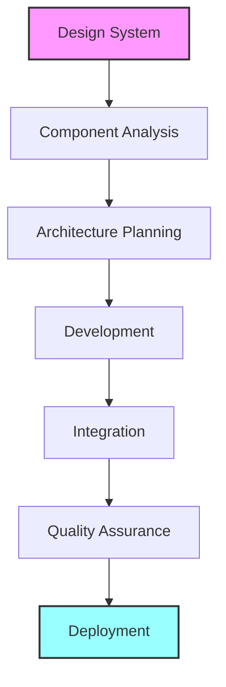
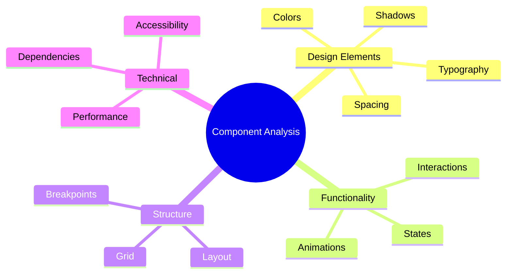
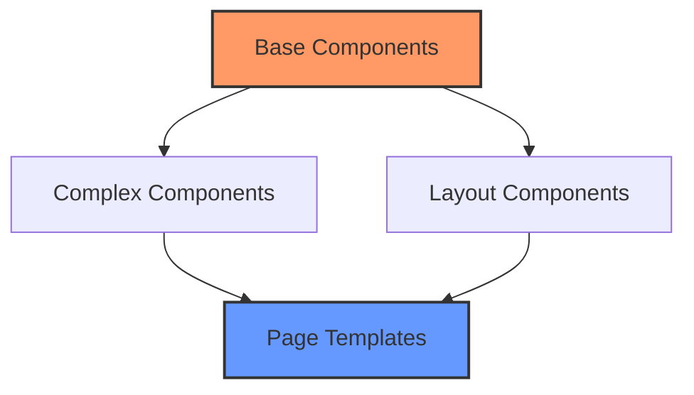
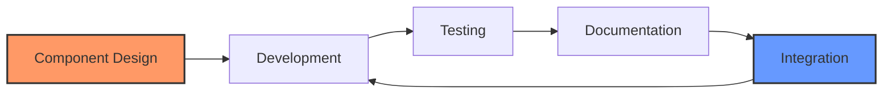
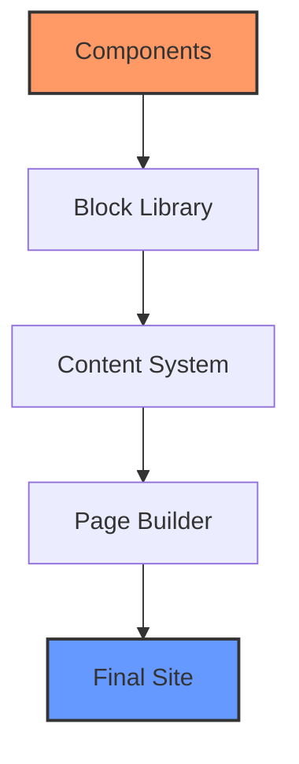
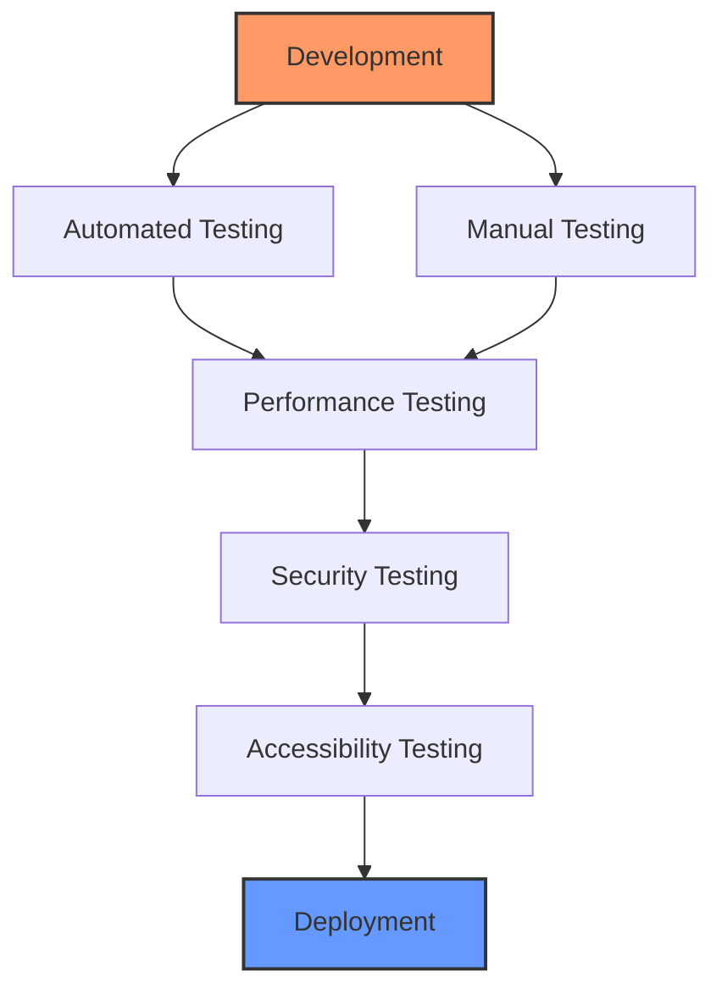
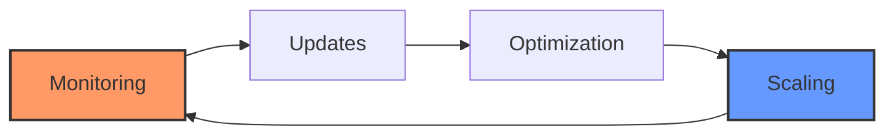
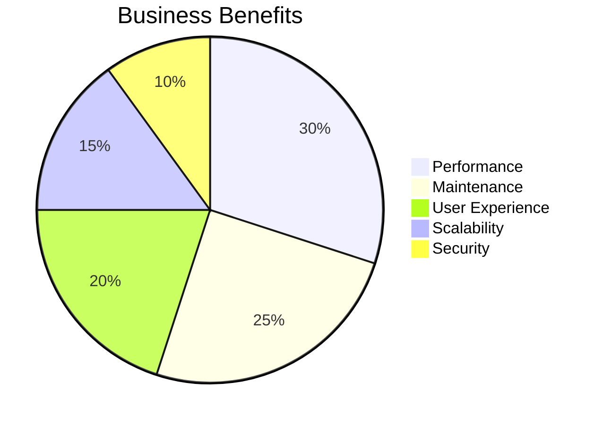
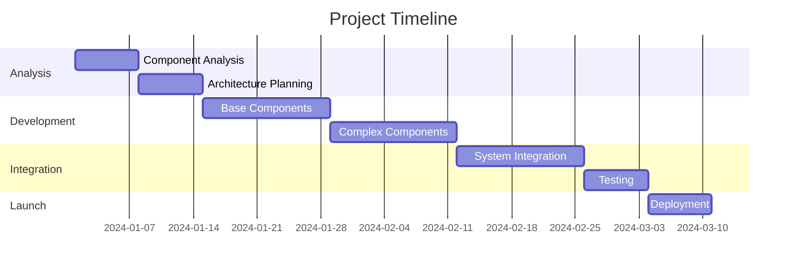

import Mermaid from '../../components/mermaid.astro';

## The Bridge Between Design and Reality

In our previous articles, we explored the Artisan Gutenberg Workflow and creating professional design systems in Figma. Now, we'll reveal how professional WordPress developers turn these designs into reality.

The gap between a beautiful design and a functioning website is where many projects fail. This failure isn't usually due to poor design or inadequate development skills - it's because of a missing systematic approach to implementation.

## The Professional Implementation Process

<Mermaid>

</Mermaid>

Professional WordPress development follows a structured path that ensures quality at every step. Let's explore each phase in detail.

## Phase 1: Component Analysis

Before writing any code, professional developers perform a thorough analysis of your design system. This critical phase sets the foundation for successful implementation.

<Mermaid>

</Mermaid>

Think of this phase like a master chef preparing for a complex meal. Before any cooking begins, they review the recipe, prepare their ingredients, and organize their workspace. Similarly, professional developers analyze every aspect of your design to ensure smooth implementation.

During this phase, developers:

1. Review every design component in detail
2. Identify common patterns and variations
3. Document functionality requirements
4. Plan technical architecture
5. Assess potential challenges

This thorough analysis prevents costly mistakes and ensures efficient development.

## Phase 2: Architecture Planning

With a clear understanding of your design system, developers create a comprehensive implementation plan.

<Mermaid>

</Mermaid>

This hierarchy ensures:

- Maximum component reusability
- Consistent behavior across the site
- Efficient maintenance processes
- Optimal performance
- Scalable architecture

Think of this like planning a city. You don't start by building skyscrapers - you first establish the infrastructure, utilities, and basic services that support everything else.

## Phase 3: Development Process

Professional development follows a systematic approach that transforms designs into functioning components.
<Mermaid>

</Mermaid>

This iterative process ensures each component:

- Matches design specifications exactly
- Functions flawlessly across devices
- Maintains high performance
- Integrates seamlessly with other components
- Includes complete documentation

Consider how a luxury car manufacturer builds vehicles. Each part isn't just functional; it's precisely engineered, thoroughly tested, and perfectly integrated with the whole system.

## Phase 4: Integration Strategy
<Mermaid>

</Mermaid>

Integration is where components come together to create a cohesive system. This phase requires careful attention to:

1. Component Relationships

   - How components interact
   - Data flow between elements
   - State management
   - Performance optimization

2. User Experience

   - Content editor interface
   - Preview functionality
   - Error handling
   - Help documentation

3. System Performance
   - Load time optimization
   - Resource management
   - Caching strategy
   - Server configuration

## Quality Assurance System

Professional development includes comprehensive testing at every stage.
<Mermaid>

</Mermaid>

Each component undergoes rigorous testing:

| Test Type     | Purpose                | Tools Used            |
| ------------- | ---------------------- | --------------------- |
| Functionality | Feature verification   | Automated test suite  |
| Performance   | Speed and efficiency   | GTmetrix, WebPageTest |
| Compatibility | Cross-device testing   | BrowserStack          |
| Security      | Vulnerability checking | Security scanners     |
| Accessibility | WCAG compliance        | WAVE, aXe             |

## Maintenance and Growth

A professional implementation includes plans for future maintenance and scaling.
<Mermaid>

</Mermaid>

This ongoing process ensures your website:

- Maintains peak performance
- Stays secure and updated
- Scales with your business
- Adapts to new requirements
- Preserves code quality

## Business Impact

Professional implementation delivers measurable benefits:
<Mermaid>

</Mermaid>

These benefits translate to:

- Faster loading times
- Higher conversion rates
- Better user engagement
- Lower maintenance costs
- Improved ROI

## Implementation Timeline

Professional implementation follows a structured timeline:
<Mermaid>

</Mermaid>
This timeline ensures:

- Proper planning
- Quality development
- Thorough testing
- Successful deployment

## Next Steps: Deployment and Maintenance

The implementation phase is crucial, but it's not the end of the journey. In our next article, "The Artisan Deployment Workflow: Launching and Maintaining Professional WordPress Sites," we'll explore how professional agencies:

- Deploy WordPress sites securely
- Maintain high performance
- Manage updates effectively
- Monitor site health
- Ensure long-term success

## Conclusion

Professional WordPress development is about more than just writing code. It's about creating a sustainable, scalable system that grows with your business.

The Artisan Development Workflow ensures your website is:

- Built professionally
- Maintained properly
- Scaled effectively
- Future-proofed
- Business-ready

This systematic approach to implementation is what separates professional WordPress development from quick fixes and temporary solutions. It's an investment in your business's digital future.

Remember: The quality of implementation determines the long-term success of your website. Choose professional development to ensure your business gets the results it deserves.
