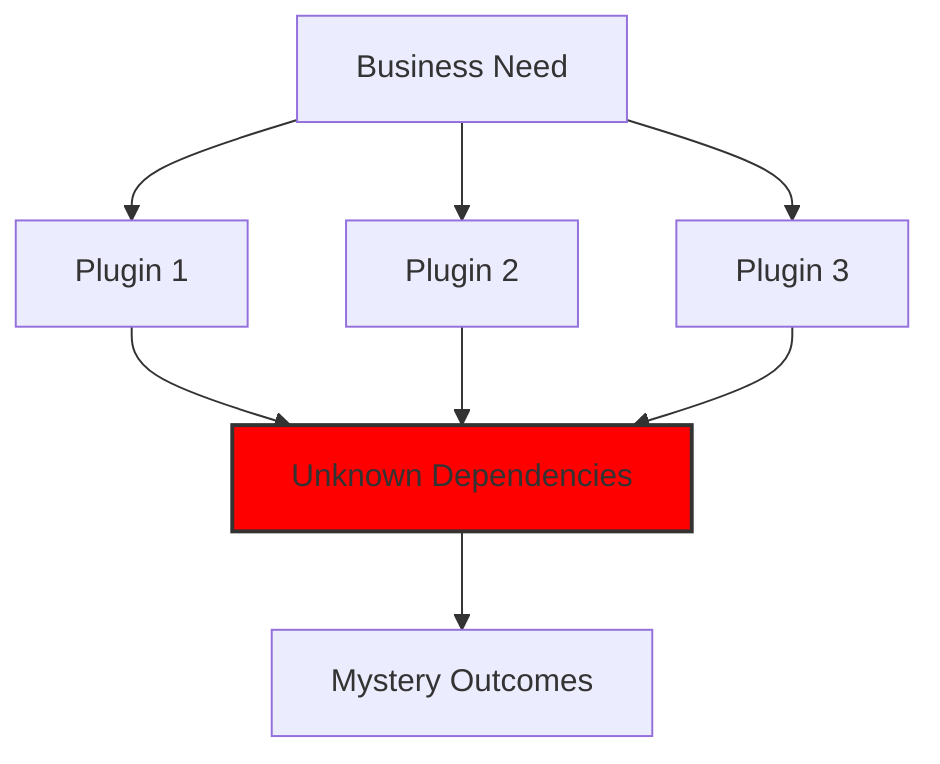
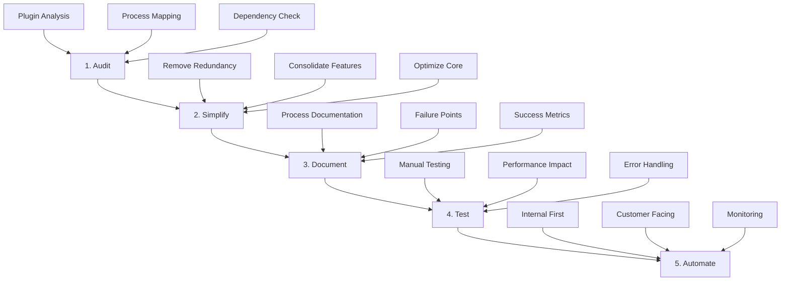
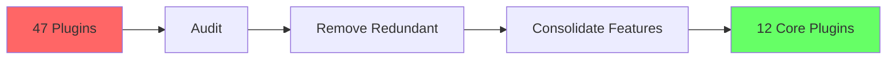
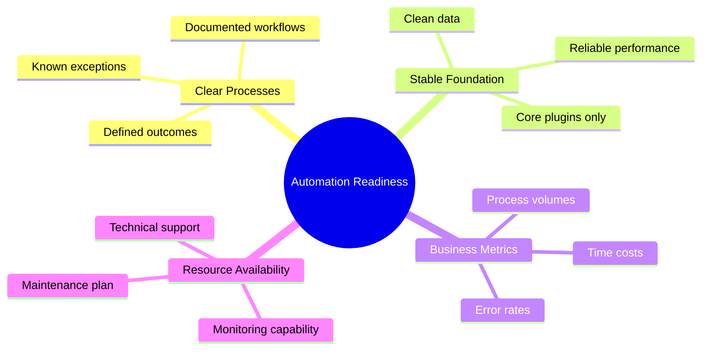
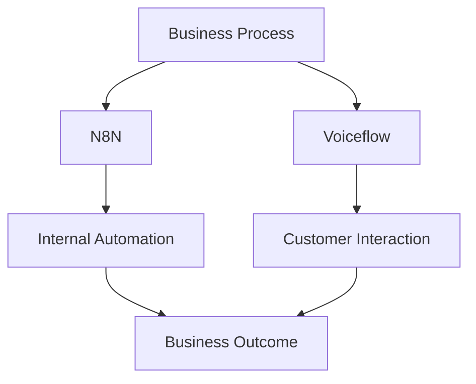
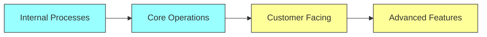
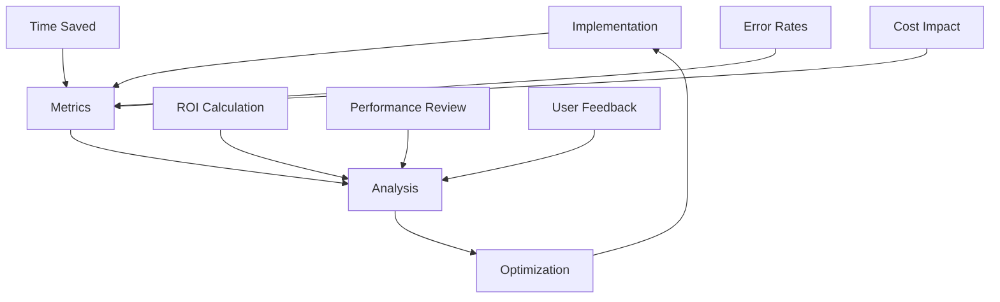

When Tom approached us about automating his WooCommerce store's operations, he was running 47 plugins. "I want to automate everything," he said. "Orders, inventory, customer service, marketing - the works." After reviewing his setup, we delivered unexpected advice: "Let's remove some automation first." Six months later, with just 12 core plugins and strategic automation, his store runs faster, more reliably, and truly automatically. His story illustrates a crucial truth about business automation: sometimes less is more.

## The Black Box Problem



Many businesses operate in what we call a "black box" state:
- 25+ plugins with unknown interactions
- Overlapping functionalities
- Unclear dependency chains
- Mysterious failure points

Adding automation to this situation is like building a house on quicksand. Before we can automate, we need solid ground.

## The 5-Step Clarity Process



### 1. Audit Phase
First, we need to understand what's actually happening in your business:

```
Current State Analysis:
├── Plugin Audit
│   ├── Active plugins
│   ├── Functionality overlap
│   └── Resource usage
├── Process Mapping
│   ├── Core workflows
│   ├── Decision points
│   └── Manual steps
└── Dependency Check
    ├── Plugin interactions
    ├── Critical paths
    └── Failure points
```

### 2. Simplification Phase
Before adding automation, we remove unnecessary complexity:



Sarah's e-commerce store went from 53 plugins to 15:
- Load time: 3.2s → 800ms
- Server resources: -65%
- Error rates: -90%
- Support tickets: -70%

### 3. Documentation Phase
We can't automate what we don't understand:

```
Process Documentation:
├── Core Workflows
│   ├── Order processing
│   ├── Inventory management
│   └── Customer service
├── Decision Points
│   ├── Business rules
│   ├── Exceptions
│   └── Manual overrides
└── Integration Points
    ├── Data flow
    ├── API connections
    └── Third-party services
```

## The Right Time to Automate

How do you know you're ready for automation? Use our readiness checklist:



### Red Flags: When Not to Automate

```
Warning Signs:
├── Process Issues
│   ├── Undefined workflows
│   ├── Frequent changes
│   └── High exception rates
├── Technical Debt
│   ├── Plugin overload
│   ├── Performance issues
│   └── Data inconsistency
└── Resource Constraints
    ├── Limited monitoring
    ├── No maintenance plan
    └── Unclear ownership
```

## Our Automation Stack

When the time is right, we implement automation using enterprise-grade tools:



### N8N Implementation
```
Workflow Automation:
├── Internal Processes
│   ├── Order handling
│   ├── Inventory updates
│   └── Reporting
├── Integration
│   ├── API connections
│   ├── Data sync
│   └── Error handling
└── Monitoring
    ├── Performance
    ├── Success rates
    └── Error logs
```

### Voiceflow Integration
```
Customer Interaction:
├── Support Automation
│   ├── Common queries
│   ├── Order status
│   └── Product info
├── User Experience
│   ├── Natural language
│   ├── Context awareness
│   └── Handoff rules
└── Analytics
    ├── Interaction data
    ├── Success metrics
    └── Improvement areas
```

## The Progressive Automation Approach

We implement automation in stages:



### Stage 1: Internal Automation
```
Focus Areas:
├── Data Entry
│   ├── Order processing
│   ├── Inventory updates
│   └── Customer records
├── Reporting
│   ├── Daily metrics
│   ├── Performance data
│   └── Error logging
└── Notifications
    ├── Status updates
    ├── Alert systems
    └── Team communication
```

### Stage 2: Customer-Facing Automation
```
Implementation:
├── Support
│   ├── FAQ responses
│   ├── Order updates
│   └── Product information
├── Communication
│   ├── Order confirmations
│   ├── Shipping updates
│   └── Review requests
└── Experience
    ├── Personalization
    ├── Recommendations
    └── Custom notifications
```

## Measuring Automation Success



### Success Metrics
```
Key Indicators:
├── Efficiency
│   ├── Time saved
│   ├── Resource utilization
│   └── Process speed
├── Quality
│   ├── Error rates
│   ├── Accuracy
│   └── Consistency
└── Impact
    ├── Cost reduction
    ├── Customer satisfaction
    └── Team productivity
```

## Real-World Results

Mark's business after proper automation implementation:
- Manual tasks: -85%
- Error rates: -95%
- Customer response time: -70%
- Team productivity: +40%

## Conclusion

Automation isn't about implementing every possible automated solution – it's about creating sustainable, reliable processes that grow with your business. The path to successful automation starts with simplification and understanding. Only then can you build automated systems that truly serve your business needs.

Remember Tom's store? With fewer plugins and strategic automation:
- Order processing time: -90%
- Customer satisfaction: +45%
- Team productivity: +60%
- Revenue: +35%

The key isn't just automating – it's automating right. Start by removing the mystery from your business operations, then build automation that serves your specific needs. That's how you create sustainable, scalable business growth.

Ready to explore automation for your business? [Schedule a consultation](/schedule) to discuss your needs and find out if you're ready for automation.
